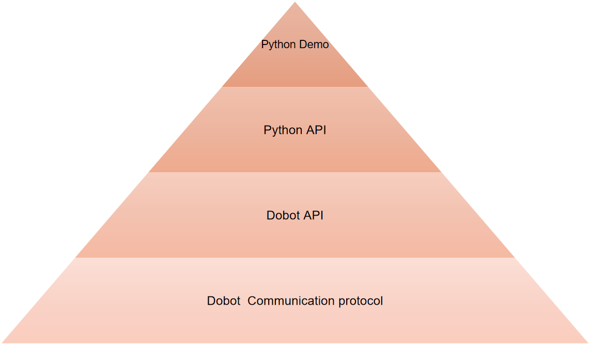

# DobotDemoForPython64

DobotDemoForPython64 is the demo of python package dynamic library files. It can be used directly by the python function to control Dobot Magician.

This document describes the secondary development environment building and demo python codes, frameworks, and systems, aiming to help secondary developer to understand common API of Dobot Magician and build development environment quickly.

<div align=center>



</div>

## Files Description

- Dll files contain the api functions needed to control Dobot Magician.
- DobotDllType.py : Specific implementing file. This section encapsulate api functions provided by the dll as python function.
- DobotControl.py : Secondary encapsulation of Dobot API. In order to get you up and running quickly, the code in the example adds a certain comment for easy reading.Examples are as follows:

```python
#将dll读取到内存中并获取对应的CDLL实例
#Load Dll and get the CDLL object
api = dType.load()

#建立与dobot的连接
#Connect Dobot
state = dType.ConnectDobot(api, "", 115200)[0]
print("Connect status:",CON_STR[state])
```

## Python API

DobotDllType.py encapsulates the C type interface of Dobot DLL, which is Python API of Dobot. The example for loading DLL is shown as follows.

```PYTHON
def load():
    if platform.system() == "Windows":
        return CDLL("DobotDll.dll",  RTLD_GLOBAL)
    elif platform.system() == "Darwin" :
        return CDLL("libDobotDll.dylib",  RTLD_GLOBAL)
    elif platform.system() == "Linux":
        return cdll.loadLibrary("libDobotDll.so")
```

## Usage

- For Windows OS, please add the DLLs directory to environment variable Path.
- For Linux OS, please add the following statement at the end of `~/.bash_profile` file and restart computer.
```
export LD_LIBRARY_PATH=$LD_LIBRARY_PATH:DOBOT_LIB_PATH
```
- For Mac OS
If the following error occurs, the solution is:
```python
File "/Library/Frameworks/Python.framework/Versions/3.7/lib/python3.7/ctypes/__init__.py", line 356, in __init__
    self._handle = _dlopen(self._name, mode)
OSError: dlopen(libDobotDll.dylib, 10): image not found
```

```
% cd DobotDemoForPython
% otool -L libDobotDll.dylib
```
The executable_path part, all use the tools of `install_name_tool` to modify the path.

```python
# install _name_tool -change <old path> <new path> libDobotDll.dylib
install_name_tool -change @executable_path/QtSerialPort.framework/Versions/5/QtSerialPort /Users/outannexway/Downloads/Dobot/DobotDemoV2.0-20170118/DobotDemoForPython/QtSerialPort.framework/Versions/5/QtSerialPort libDobotDll.dylib
```
- cd DobotDemoForPython
Use vscode debugging, be sure to use the DobotDemoForPython path
- Connect the Dobot Magician
- python DobotControl.py

## Attention

##### There are the following points to note:
- You need to add the DLL address to the system environment variable
- A 32-bit system corresponds to a 32-bit dynamic library, and a 64-bit system corresponds to a 64-bit dynamic library
- please use the python 64 bit environment.


